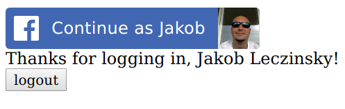

# &lt;/salt&gt;

## Salt Authentication

### Basic Setup

You currently have a very basic server with the Express framework running on port 8080 över HTTP.
Start the server, `node server.js`, and verify that you can access the server using curl `curl http://localhost:8080`.

### HTTPS

The first thing you will do is to refactor this server to use HTTPS.
The first step is to create the secure key and the self signed certificate.

#### OpenSSL

Make sure you have [openssl](https://www.openssl.org/) installed on your computer. 
If not, install it using `homebrew`.

1. Create a new folder called `certificates` and cd into it.
2. Generate a new 1024bit RSA key and call it `server.key` like so `openssl genrsa -des3 -out server.key 1024`.
3. Generate a new signed certificate and call it `server.csr` like so `openssql req -new -key server.key -out server.csr`. Use `localhost` as the `Common Name`.
4. Make a copy of your key and call it `server.key.org`.
5. Then do `openssl rsa -in server.key.org -out server.key`
6. Finally, create the self signed certificate `openssl x509 -req -days 365 -in server.csr -signkey server.key -out server.crt`.

Now you can configure your express server to use HTTPS instead of HTTP.

Restart your server and verify that it works by using curl with the flag `--cacert` to point out the certificate.

### Facebook

#### Create a Facebook account

If you haven't got one already, create one. 
If you already have one, use that since it is against the Facebook user agreement to have multiple accounts.

#### Become a Facebook developer and create your app

Register your account at (https://developers.facebook.com/). 
Then you should be able to create a new facebook web app. Follow the guides.

Once your app is created, you should find it's `App ID` and the `App Secret` in the `Settings` menu.

#### Create the facebook login page

You should now create a Facebook login button in the file `login.html` in your project. [Follow this guide](https://developers.facebook.com/docs/facebook-login/web).
You will now have to use the `App ID` that belongs to your now Facebook app.

Follow the links in the guide to create a button with a picture of the user. Also implement a logout button.

The page should now look something like this

Make sure you can login and logout. The page isn't very dynamic at this point, so you will have to refresh to see the effect when logging out.

Open the developer console and examine the response you get from Facebook. Especially not the `access_token` you get.

### Backend

Now, it's time to create a backend service for our authentication. 
Create a new resource under `/api/auth/facebook` that you will use to validate the `access_token` that you got from calling the Facebook api.

Make sure you can call this endpoint by _posting_ a request body with the `access_token` from facebook like so `curl --cacert ./certificates/server.crt -H 'content-type: application/json' -d '{"access_token": "some-token"}' https://localhost:8443/api/auth/facebook'`.
Next, try to make the post request from the `statusChangeCallback` function in your login page using `fetch`.

#### Passport

_Passport_ is Express middleware to handle Oauth2. Install Passport and its Facebook strategy like so `npm install passport passport-facebook-token`.

